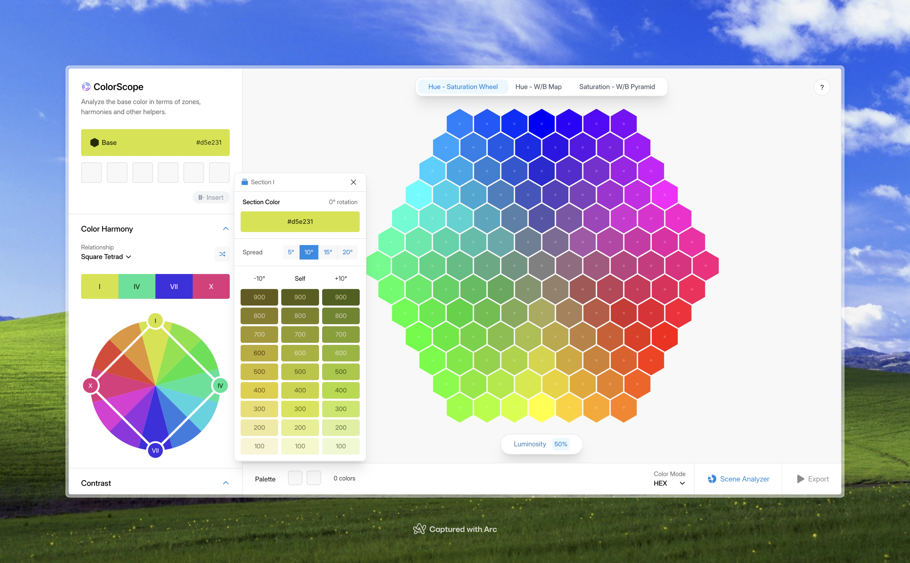

# Color Analysis Tool (ColorScope)

This is a color analysis and palette generation tool that has advanced color analysis systems for designers, photographers and editors, working on web technologies. After analyzing and composing, a color palette is exportable to different formates including web links, `pdf`, `css` or `xml`.

## Installation

Since this is a web app, apparently, you need [NodeJS](https://nodejs.org/en) installed.

- `npm install`: Installs the necessary dependencies.
- `npm run dev`: Runs the local development server on [localhost:5173](http://localhost:5173).
- `npm run build`: Build the project as a client only bundle.
- `npm run preview`: Runs the built project.

## Technicality & Implementation

### Technologies:

- `react`: Client-side rebderubg library.
- `react-router`: Client-side router.
- `vite`: Bundler of the project.
- `motion.dev`: For microinteractions and animations.
- `phosphor-icons`: Icons of the applications.

## Examples

---

Muhammed Can Durmus | 2025
